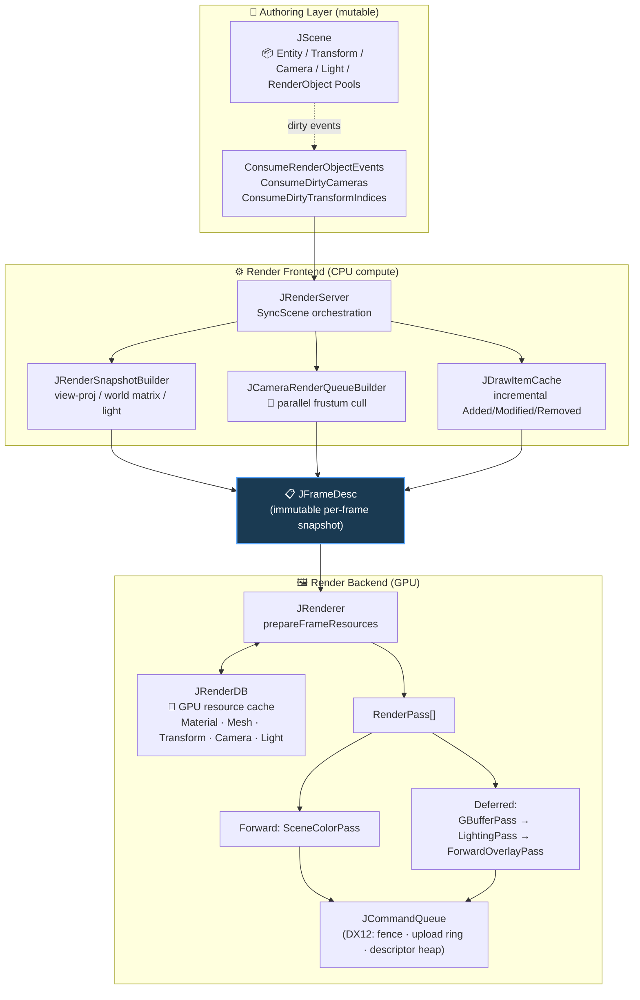
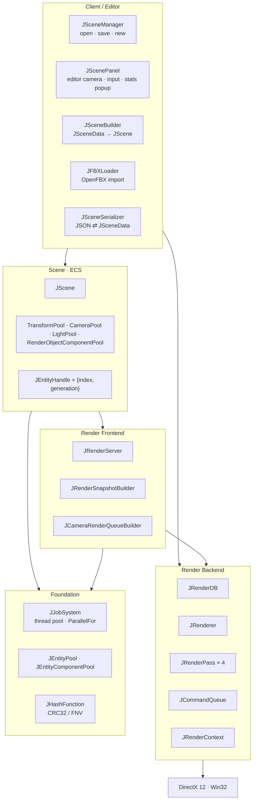
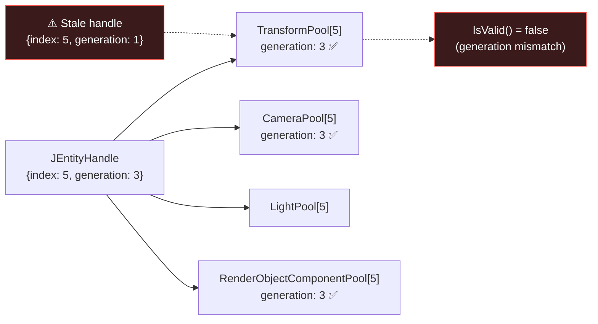
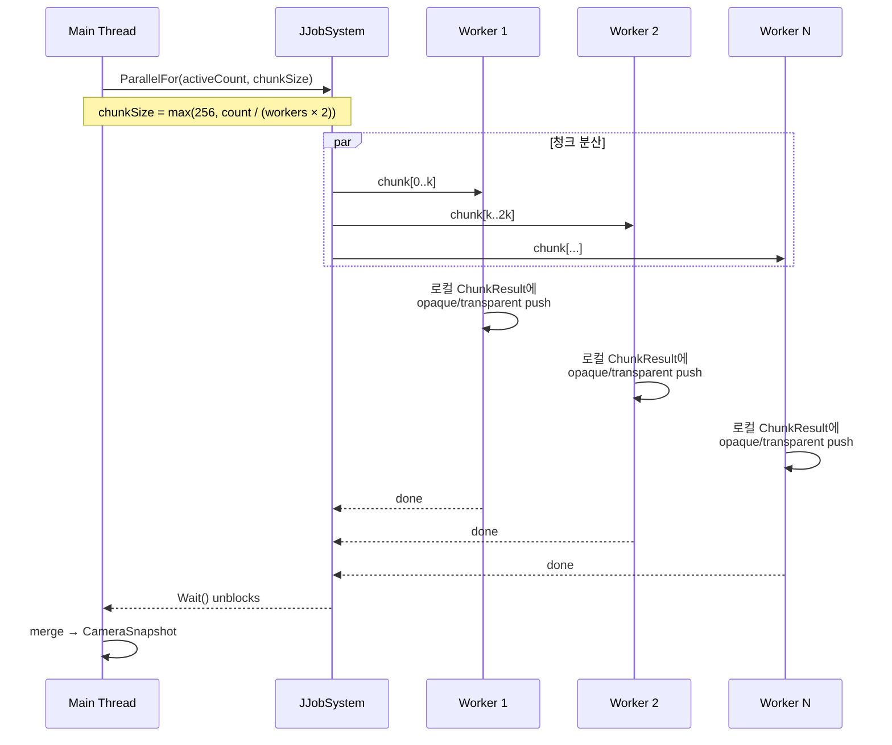

# JYEngine

> **DirectX 12 기반 데이터 지향(DOD) 미니 렌더링 엔진** — Scene/Snapshot/Renderer 단방향 데이터 흐름과 ECS-lite 컴포넌트 풀, 병렬 frustum culling을 직접 설계·구현했습니다.

[]()
[]()
[]()
[]()

---

## 한눈에 보는 특징

| 영역 | 패턴 | 한 줄 요약 |
|---|---|---|
| **씬 ↔ 렌더 분리** | Immutable `JFrameDesc` snapshot | Scene의 mutable 상태가 Renderer로 새지 않는 단방향 흐름 |
| **ECS-lite** | `{index, generation}` handle + 컴포넌트별 Pool | dangling reference 방지 + SoA 친화 레이아웃 |
| **Transform** | SoA 분리 + dirty index ring | 변경된 transform만 GPU에 동기화 |
| **렌더 패스** | Forward / Deferred 동시 지원 | `JRenderPass` 인터페이스로 통일, 런타임 전환 가능 |
| **컬링** | 자체 잡 시스템 기반 병렬 frustum cull | 청크 분할 → worker별 local result → merge |
| **셰이더** | `ID3D12ShaderReflection` 기반 root signature 자동 생성 | CBV/SRV/Sampler를 코드 변경 없이 바인딩 |
| **드로우 캐시** | Added/Modified/Removed 이벤트 기반 incremental 갱신 | 매 프레임 전체 재구축 회피 |
| **벤치마크** | OOP / AoS / SoA / WorldMatrix 4종 레이아웃 비교 | TBB 기반 데이터 레이아웃 측정 인프라 |

> 더 깊이 있는 설계 의도는 [**Data-Oriented Engine Design 회고록**](docs/DATA_ORIENTED_ENGINE_DESIGN_2026-05-26.md)을 참고하세요.

---

## 아키텍처 다이어그램

### 1. 한 프레임의 데이터 흐름 (핵심)

씬은 mutable, 프레임은 immutable — 둘을 잇는 것이 `JRenderServer`의 책임입니다.



**이 다이어그램이 왜 중요한가** — 대부분의 토이 엔진은 `Scene → Renderer`가 직접 결합되어 있어, 렌더 스레드 분리·리플레이·헤드리스 렌더링 같은 확장이 어렵습니다. JYEngine은 `JFrameDesc`라는 **불변 프레임 스냅샷**을 경계에 둠으로써 향후 멀티스레드 렌더링이나 GPU-driven 파이프라인으로 확장할 수 있는 토대를 만들어 두었습니다. (UE5의 `ENQUEUE_RENDER_COMMAND`, Frostbite의 render-thread 분리와 같은 발상.)

---

### 2. 모듈 계층



---

### 3. ECS-lite 핸들 모델



**Entity index = Component slot index** 라는 강한 규약을 둬서 lookup 비용을 없앴습니다. 하나의 엔티티에 같은 종류 컴포넌트는 하나만 — Unity의 `GetComponent<T>()`처럼 다중 인스턴스 시나리오는 의도적으로 배제했습니다.

---

### 4. 병렬 Frustum Culling 흐름



Worker간 공유 자료구조 lock 경합을 없애기 위해 **chunk별 local result**를 쓰고 main thread에서 merge합니다.

---

## 모듈 구조

```
src/
├── engine/
│   ├── core/        JEngine, JJobSystem, JPool, JHashFunction
│   ├── scene/       JScene, *Pool, JSceneSerializer
│   ├── render/      JRenderer, JRenderServer, JRenderDB,
│   │                JRenderPass, JCommandQueue, JRenderContext
│   ├── asset/       JMaterial, JMesh, JShader
│   ├── platform/    JDevice
│   └── dx12/        JDx12Helper, d3dx12 wrapper
├── client/
│   ├── editor/      JSceneManager, JScenePanel, JSceneBuilder,
│   │                JFBXLoader, JAssetManager
│   └── OpenFBX/     vendored FBX 임포터
benchmark/           OOP / AoS / SoA / WorldMatrix 데이터 레이아웃 비교
docs/                설계 회고 문서
third_party/         nlohmann/json
```

---

## 핵심 설계 결정과 트레이드오프

| 결정 | 채택한 것 | 의도적으로 버린 것 | 이유 |
|---|---|---|---|
| Scene ↔ Renderer 결합 | `JFrameDesc` immutable snapshot | Scene을 Renderer가 직접 읽기 | 멀티스레드 렌더·리플레이 확장성 |
| Entity-Component 매핑 | Entity index = Component slot | hash map lookup | O(1) 접근, 캐시 친화 |
| Transform 레이아웃 | SoA (`vector<JVec3>` × 3) | AoS struct | culling/sync hot path 가속 |
| 드로우 큐 갱신 | 이벤트 기반 incremental | 매 프레임 rebuild | 변경 비율이 낮은 일반 케이스 최적화 |
| Root signature | 셰이더 리플렉션 자동 생성 | 수동 정의 | 머터리얼 데이터 드리븐화 |
| 잡 시스템 | std::thread + condition_variable | TBB 의존 | 벤더 lock-in 회피 (TBB는 측정용으로만 사용) |

---

## 빌드 & 실행

### 요구 사항

- **OS**: Windows 10 이상
- **Graphics API**: Direct3D 12 (`D3D_FEATURE_LEVEL_11_0` 이상)
- **Toolchain**: Visual Studio + C++ desktop workload, Windows 10 SDK
- **선택**: `Graphics Tools` (D3D12 debug layer)

> D3D12 디바이스를 직접 생성하므로, D3D12를 지원하지 않는 PC에서는 실행되지 않습니다.

### 실행 옵션

```bash
# 기본 샘플 씬으로 실행
JYEngine.exe

# 빈 씬에서 시작
JYEngine.exe --new

# 특정 씬 파일 로드
JYEngine.exe --scene path/to/scene.jscene.json
```

---

## 로드맵

진행 우선순위 기준 — *작은 작업부터, 시각적 임팩트 큰 것 우선:*

- [ ] **PSO / Shader 캐시** — 머터리얼 dirty 시 PSO 전체 재생성 회피
- [ ] **DEFAULT-heap 메시 업로드** — 정적 메시를 UPLOAD heap에서 분리
- [ ] **Shadow Mapping** — 첫 비주얼 임팩트 추가 대상
- [ ] **PBR Material + Tone Mapping** — 머니샷 제작 목적
- [ ] **씬 그래프 hierarchy** — 부모-자식 attach, world matrix propagation
- [ ] **인스턴싱** — 동일 mesh+material 묶음 처리
- [ ] **벤치마크 결과 정량화** — 10K objects 기준 SyncScene/Cull/Render ms 측정
- [ ] **얇은 RHI 추상화** — Vulkan/Metal 백엔드 가능성 열기

---

## 더 읽어보기

- 📖 [**Data-Oriented Engine Design 회고**](docs/DATA_ORIENTED_ENGINE_DESIGN_2026-05-26.md) — 설계 의도와 시행착오 기록
- 🔬 `benchmark/` — OOP / AoS / SoA / WorldMatrix 레이아웃 비교용 벤치마크 코드

---

<sub>© JYEngine — 단독 개발 / 학습·포트폴리오 목적 / DirectX 12 · C++17/20</sub>
